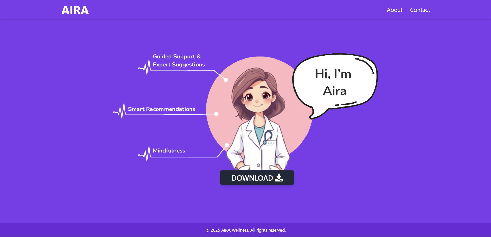

# AIRA - Mental Wellness Assistant

AIRA is a single-page web application designed to promote mental wellness. The page features a floating image, an animated "Download" button, and a responsive header with navigation links. Built with **React**, **Tailwind CSS**, and **Framer Motion**, this project showcases smooth animations and a modern design.

---

## Features

- **Floating Image**: The central image gently floats up and down using Framer Motion animations.
- **Animated Download Button**: The "Download" button has a ripple effect on click and changes color on hover.
- **Responsive Header**: The header includes a logo and navigation links ("About" and "Contact") with hover animations.
- **Footer**: A simple footer displays the copyright information.
- **Single-Page Layout**: The entire content fits on a single page without scrolling.

---

## Technologies Used

- **React**: A JavaScript library for building user interfaces.
- **Tailwind CSS**: A utility-first CSS framework for styling.
- **Framer Motion**: A production-ready motion library for React.
- **Font Awesome**: Icons for the download button.
- **Google Fonts**: Custom font for the logo.

---

## Installation

Follow these steps to set up the project locally:

1. **Clone the Repository**:
   ```bash
   git clone https://github.com/Royal-Dragon/chat-bot-page.git
   cd chat-bot-page
   ```

2. **Install Dependencies**:
   ```bash
   npm install
   ```

3. **Run the Development Server**:
   ```bash
   npm run dev
   ```

4. **Open in Browser**:
   The application will open at `http://localhost:3000`.

---

## Project Structure

```
aira-mental-wellness/
├── public/
│   ├── index.html
│   └── assets/
│       └── middle.png (example image)
├── src/
│   ├── App.jsx (main component)
│   ├── index.js (entry point)
│   └── assets/
│       └── middle.png (example image)
├── package.json
├── README.md
└── tailwind.config.js (Tailwind CSS configuration)
```

---

## Customization

- **Change the Image**:
  Replace the `middle.png` file in the `src/assets` folder with your desired image.

- **Update Colors**:
  Modify the colors in the `bg-black`, `hover:bg-gray-700`, and other Tailwind CSS classes to match your branding.

- **Add More Pages**:
  Extend the project by adding more pages and routing using `react-router-dom`.

---

## Contributing

Contributions are welcome! If you'd like to contribute, please follow these steps:

1. Fork the repository.
2. Create a new branch (`git checkout -b feature/your-feature`).
3. Commit your changes (`git commit -m 'Add some feature'`).
4. Push to the branch (`git push origin feature/your-feature`).
5. Open a pull request.

---

## License

This project is licensed under the MIT License. See the [LICENSE](LICENSE) file for details.

---

## Acknowledgments

- **Tailwind CSS** for making styling effortless.
- **Framer Motion** for enabling smooth animations.
- **Font Awesome** for providing icons.

---

## Screenshot

  


---

Let me know if you need further assistance! 😊